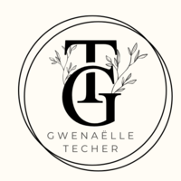

# Gwenaelle-Techer - Portfolio
# Portfolio - Gwenaëlle Techer

A responsive personal portfolio website showcasing my skills, projects, and contact information.



## Table of Contents

- [Description](#description)
- [Features](#features)
- [File Structure](#file-structure)
- [Technologies Used](#technologies-used)
- [Setup and Installation](#setup-and-installation)
- [Usage](#usage)
- [Future Features](#future-features)
- [Contributing](#contributing)
- [Contact](#contact)

## Description

This portfolio website serves as a digital showcase of my skills, experience, and projects as a fullstack developer with a focus on frontend development. It provides visitors with an introduction to who I am, what I can do, and how to get in touch with me.

## Features

- **Responsive Design**: Optimized for various screen sizes and devices
- **Multilingual Support**: Toggle between English and French languages
- **Animated Sections**: Smooth scroll animations and fade-in effects
- **Project Showcase**: Browser-style containers to display project previews
- **Contact Section**: Easy access to email and phone contact methods
- **Resume Access**: Direct link to download my CV
- **Social Media Links**: GitHub and LinkedIn profile links

## File Structure

```
portfolio/
│
├── index.html            # Main HTML file
├── Styles/
│   ├── style.css         # Global styles
│   └── index.css         # Specific styles for index page
├── Scripts/
│   ├── i18n.js           # Internationalization script
│   └── index.js          # Main JavaScript functionality
├── Images/               # Contains all images, icons, and the CV PDF
└── README.md             # This file
```

## Technologies Used

- **HTML5**: Structure and content
- **CSS3**: Styling and animations
- **JavaScript**: Interactive functionality
- **i18next**: Internationalization library
- **jQuery**: DOM manipulation

## Setup and Installation

1. Clone the repository:
   ```
   git clone https://github.com/yourusername/portfolio.git
   ```

2. Navigate to the project directory:
   ```
   cd portfolio
   ```

3. Open `index.html` in your browser to view the website locally.

4. For development, you can use a local development server like Live Server extension in VS Code.

## Usage

- **Language Toggle**: Click the language button in the navigation to switch between English and French
- **Navigation**: Use the navigation links to jump to different sections of the website
- **Project Links**: Click on the project tabs to visit the live projects
- **Contact**: Use the email or phone buttons to get in touch
- **Resume**: Click the CV link to download or view my resume
- **Social Media**: Footer icons link to my GitHub and LinkedIn profiles

## Future Features

- **Sticky Language Switch**: Implement a fixed position language toggle button that remains accessible while scrolling through the page
- **Dark/Light Mode Toggle**: Add the ability to switch between dark and light themes
- **Project Filtering**: Add categories and filtering options for projects
- **Blog Section**: Add a blog to share my thoughts and experiences in tech
- **Contact Form**: Implement a direct contact form instead of just email/phone links
- **Project Detail Pages**: Create dedicated pages for each project with more information
- **Skill Progress Bars**: Visual representation of skill proficiency levels
- **Animations Optimization**: Improve performance of scroll and fade animations
- **Accessibility Improvements**: Ensure the site is fully accessible to all users

## Contributing

If you'd like to contribute to this project, please follow these steps:

1. Fork the repository
2. Create a feature branch (`git checkout -b feature/your-feature`)
3. Commit your changes (`git commit -m 'Add some feature'`)
4. Push to the branch (`git push origin feature/your-feature`)
5. Open a Pull Request

## Contact

- **Email**: gwentech@hotmail.fr
- **Phone**: +33 7 81 23 58 25
- **GitHub**: [gxtcr](https://github.com/gxtcr)
- **LinkedIn**: [Gwenaëlle Techer](https://www.linkedin.com/in/gwenaëlletecher/)
